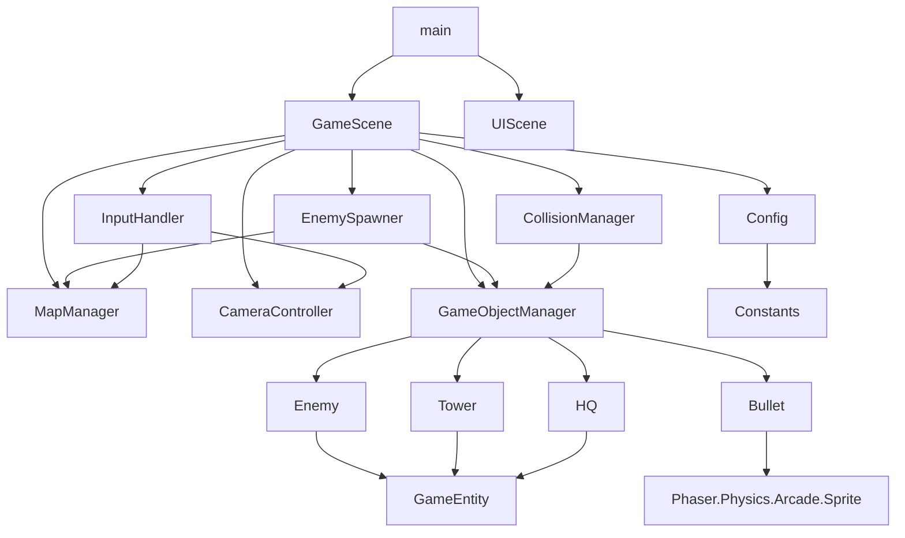

# 《神必塔防》 JavaScript API 文档
**游戏版本**: 0.2.0  
**Api文档版本**  ：1.0.0  
**Phaser版本**: 3.60+  
**最后更新**: 2025-12-27

---

## 📖 目录
1. [配置模块 (Config)](#配置模块)
2. [基础模块 (Base)](#基础模块)
3. [管理器模块 (Managers)](#管理器模块)
4. [实体模块 (Entities)](#实体模块)
5. [场景模块 (Scenes)](#场景模块)
6. [游戏入口 (Entry)](#游戏入口)
7. [模块依赖关系](#模块依赖关系)
8. [使用示例](#使用示例)

---

## 配置模块

### 1.1 Constants
核心枚举常量定义模块，集中管理所有魔法数字。

**枚举类型定义**

| 常量名称 | 数据类型 | 值 | 描述 |
|----------|----------|----|------|
| `TERRAIN.EMPTY` | `number` | `0` | 空白/装饰性地形，不可交互 |
| `TERRAIN.BUILDABLE` | `number` | `1` | 可建造防御塔的格子 |
| `TERRAIN.ROAD` | `number` | `2` | 敌人可通行的路径 |
| `SPRITE_TYPE.ENEMY` | `number` | `0` | 敌人单位碰撞分组标识 |
| `SPRITE_TYPE.BUILDING` | `number` | `1` | 静态建筑物碰撞分组标识 |
| `SPRITE_TYPE.BULLET` | `number` | `2` | 投射物碰撞分组标识 |
| `TOWER_TYPE.BASIC` | `number` | `0` | 基础塔类型（平衡属性） |
| `TOWER_TYPE.SNIPER` | `number` | `1` | 狙击塔类型（高伤低速） |
| `TOWER_TYPE.CANNON` | `number` | `2` | 加农炮类型（范围伤害） |
| `BUILD_MODE.NONE` | `number` | `0` | 正常游戏交互模式 |
| `BUILD_MODE.BUILD` | `number` | `1` | 防御塔建造模式 |
| `BUILD_MODE.REMOVE` | `number` | `2` | 防御塔拆除模式 |

---

### 1.2 AssetConfig
**静态资源路径配置对象**

**结构属性**

| 属性路径 | 数据类型 | 必需 | 值 | 描述 |
|----------|----------|------|--------|------|
| `images.enemy` | `string` | 是 | `'enemy'` | 敌人精灵图资源键名 |
| `images.tower` | `string` | 是 | `'tower'` | 防御塔精灵图资源键名 |
| `images.bullet` | `string` | 是 | `'bullet'` | 子弹精灵图资源键名 |
| `images.tileset` | `string` | 是 | `'tileset'` | 地图瓦片图集资源键名 |
| `images.hq` | `string` | 是 | `'hq'` | 基地精灵图资源键名 |
| `ui.btnBuild` | `string` | 是 | `'btn_build'` | 建造按钮UI资源键名 |
| `ui.btnRemove` | `string` | 是 | `'btn_remove'` | 拆除按钮UI资源键名 |

---

### 1.3 EntityConfig
**实体属性配置中心** - 所有游戏对象的属性配置入口

**配置结构**

```javascript
{
  tower: {
    hp: number,              // 当前生命值
    maxHp: number,           // 最大生命值
    range: number,           // 攻击范围半径（像素）
    fireRate: number,        // 攻击冷却时间（毫秒）
    enableLogging: boolean,  // 调试日志开关
    entityName: string       // 日志输出前缀
  },
  enemy: {
    hp: number,              // 当前生命值
    maxHp: number,           // 最大生命值
    speed: number,           // 沿路径移动速度（像素/秒）
    damage: number,          // 接触基地时造成的伤害
    enableLogging: boolean,
    entityName: string
  },
  hq: {
    hp: number,              // 当前生命值
    maxHp: number,           // 最大生命值
    health: number,          // 自动恢复量（每tick）
    fireRate: number,        // 恢复间隔（毫秒）
    enableLogging: boolean,
    entityName: string
  },
  bullet: {
    speed: number,           // 弹道飞行速度（像素/秒）
    damage: number           // 命中时造成的伤害
  }
}
```

---

### 1.4 GameConfig
**游戏运行时动态配置**

**属性详情**

| 属性名称 | 数据类型 | 默认值 | 单位 | 业务影响 |
|----------|----------|--------|------|----------|
| `enemySpawn.spawnDelay` | `number` | `2000` | 毫秒 | 控制敌人生成节奏 |
| `enemySpawn.initialHardlevel` | `number` | `1` | 等级 | 敌人生成器初始难度 |
| `initialHardlevel` | `number` | `1` | 等级 | 游戏全局难度基准 |

---

### 1.5 MapConfig
**地图静态数据结构配置**

**核心参数**

| 属性名称 | 数据类型 | 示例值 | 说明 |
|----------|----------|--------|------|
| `tileSize` | `number` | `64` | 单个格子的像素尺寸 |
| `tilesetKey` | `string` | `'tileset'` | Phaser资源加载键名 |
| `terrainData` | `Array<Array<number>>` | `[[0,1,2...]...]` | 地形矩阵（值对应TERRAIN枚举） |
| `path` | `Array<Object>` | `[{col:0, row:1}...]` | 敌人移动路径点逻辑坐标数组 |
| `hqPosition` | `Object` | `{col:0, row:3}` | 基地所在格子的逻辑坐标 |

---

### 1.6 CameraConfig
**相机交互参数配置**

**缩放与交互参数**

| 参数名称 | 数据类型 | 默认值 | 取值范围 | 功能描述 |
|----------|----------|--------|----------|----------|
| `minZoom` | `number` | `0.5` | `0.1 ~ 1.0` | 允许的最小缩放级别（50%） |
| `maxZoom` | `number` | `2.0` | `1.0 ~ 3.0` | 允许的最大缩放级别（200%） |
| `zoomStep` | `number` | `0.1` | `0.05 ~ 0.2` | 每次滚轮操作的缩放变化步长 |

---

## 基础模块

### 2.1 GameEntity
**游戏实体基类** - 所有可战斗单位的抽象父类

**继承链**: `Phaser.Physics.Arcade.Sprite` → `GameEntity`

#### 构造函数
```typescript
constructor(scene: Phaser.Scene, x: number, y: number, texture: string, config: object)
```

**参数说明**

| 参数名 | 类型 | 必需 | 描述 |
|--------|------|------|------|
| `scene` | `Phaser.Scene` | 是 | 实体所属Phaser场景实例 |
| `x` | `number` | 是 | 实体初始世界坐标X |
| `y` | `number` | 是 | 实体初始世界坐标Y |
| `texture` | `string` | 是 | 精灵图纹理资源键名 |
| `config` | `object` | 是 | 实体配置数据（来自EntityConfig） |

#### 实例属性

| 属性名 | 数据类型 | 可访问性 | 描述 |
|--------|----------|----------|------|
| `maxHp` | `number` | `public` | 实体最大生命值 |
| `hp` | `number` | `public` | 实体当前生命值 |
| `enableLogging` | `boolean` | `public` | 是否输出调试日志 |
| `entityName` | `string` | `public` | 实体名称（用于日志标识） |

#### 核心方法

| 方法签名 | 返回类型 | 功能描述 |
|----------|----------|----------|
| `takeDamage(dmg: number)` | `void` | 对实体造成`dmg`点伤害。若`hp ≤ 0`，自动触发`destroy()` |
| `heal(amount: number)` | `void` | 恢复`amount`点生命值，受`maxHp`上限限制 |
| `setHp(hp: number)` | `void` | 直接设置当前生命值，自动钳制在`[0, maxHp]`范围内 |
| `setMaxHp(maxHp: number)` | `void` | 修改最大生命值，并自动调整当前值不超过新上限 |
| `getHpPercent()` | `number` | 返回`0.0`到`1.0`的生命百分比 |
| `isAlive()` | `boolean` | 判断实体是否存活（`hp > 0`且`active === true`） |

---

### 2.2 MapManager
**地图数据管理器** - 负责地图渲染、坐标转换与Tile查询

#### 构造函数
```typescript
constructor(scene: Phaser.Scene, config: object)
```

**参数说明**

| 参数名 | 类型 | 描述 |
|--------|------|------|
| `scene` | `Phaser.Scene` | 所属Phaser场景 |
| `config` | `object` | 地图配置对象（优先级：用户传入 > MapConfig默认值） |

#### 实例属性

| 属性名 | 数据类型 | 描述 |
|--------|----------|------|
| `tileSize` | `number` | 网格单元像素尺寸 |
| `terrainData` | `Array<Array<number>>` | 地形类型矩阵数据 |
| `path` | `Array<{col: number, row: number}>` | 敌人行走路径逻辑坐标 |
| `tilemap` | `Phaser.Tilemaps.Tilemap` | Phaser瓦片地图实例 |

#### 核心方法

| 方法签名 | 返回类型 | 功能描述 |
|----------|----------|----------|
| `createMap()` | `void` | 初始化Tilemap，为每个Tile附加`buildable`、`walkable`、`hasTower`属性 |
| `isBuildable(tile: Phaser.Tilemaps.Tile)` | `boolean` | 判断指定Tile是否允许建造防御塔 |
| `isRemovable(tile: Phaser.Tilemaps.Tile)` | `boolean` | 判断指定Tile是否存在可拆除的塔 |
| `pathToPixelPath(path: Array)` | `Array<{x: number, y: number}>` | 将逻辑坐标路径转换为像素中心坐标路径 |
| `getPixelPath()` | `Array<{x: number, y: number}>` | 获取地图的像素化路径（供Enemy使用） |
| `getTileAtWorldXY(x: number, y: number)` | `Phaser.Tilemaps.Tile` | 根据世界坐标查询对应的Tile对象 |
| `getTileAt(col: number, row: number)` | `Phaser.Tilemaps.Tile` | 根据逻辑行列坐标查询Tile对象 |
| `getTileSize()` | `number` | 返回单个格子的像素尺寸 |
| `getMapSize()` | `{width: number, height: number}` | 返回地图的总像素尺寸 |

---

## 管理器模块

### 3.1 EnemySpawner
**敌人工厂** - 控制敌人生成节奏与难度

#### 构造函数
```typescript
constructor(scene: Phaser.Scene, mapManager: MapManager, gameObjectManager: GameObjectManager, config?: object)
```

**参数说明**

| 参数名 | 类型 | 必需 | 描述 |
|--------|------|------|------|
| `scene` | `Phaser.Scene` | 是 | 所属场景 |
| `mapManager` | `MapManager` | 是 | 地图管理器（获取路径） |
| `gameObjectManager` | `GameObjectManager` | 是 | 对象管理器（注册敌人） |
| `config` | `object` | 否 | 可选配置（覆盖默认生成参数） |

#### 实例属性

| 属性名 | 数据类型 | 初始值 | 描述 |
|--------|----------|--------|------|
| `spawnDelay` | `number` | `2000` | 敌人生成间隔（毫秒） |
| `hardlevel` | `number` | `1` | 当前难度等级 |
| `isSpawning` | `boolean` | `false` | 生成器运行状态标志 |
| `spawnTimer` | `Phaser.Time.TimerEvent` | `null` | Phaser定时事件对象 |

#### 核心方法

| 方法签名 | 返回类型 | 功能描述 |
|----------|----------|----------|
| `start()` | `void` | 启动生成定时器，设置`isSpawning = true` |
| `stop()` | `void` | 停止生成定时器，设置`isSpawning = false` |
| `spawnEnemy()` | `void` | 核心方法：生成一个`Enemy`实例并注册到`GameObjectManager` |
| `setSpawnDelay(delay: number)` | `void` | 动态修改生成间隔，自动重启定时器 |
| `setHardlevel(level: number)` | `void` | 动态设置难度等级（影响后续生成的敌人属性） |
| `spawnEnemyNow()` | `void` | 立即手动触发一次敌人生成（用于特殊事件） |

---

### 3.2 GameObjectManager
**全局对象池管理中心** - 统一CRUD与更新所有游戏实体

#### 构造函数
```typescript
constructor(scene: Phaser.Scene)
```

**参数说明**

| 参数名 | 类型 | 描述 |
|--------|------|------|
| `scene` | `Phaser.Scene` | 所属场景，用于创建Phaser Group |

#### 实例属性

| 属性名 | 数据类型 | 描述 |
|--------|----------|------|
| `enemies` | `Phaser.GameObjects.Group` | 敌人对象池（自动管理物理体） |
| `towers` | `Array<Tower>` | 防御塔数组（静态管理，非Group） |
| `bullets` | `Phaser.GameObjects.Group` | 子弹对象池 |
| `hq` | `HQ` | 基地单例对象 |

#### 核心方法

| 方法签名 | 返回类型 | 功能描述 |
|----------|----------|----------|
| `createHQ(x: number, y: number)` | `HQ` | 创建基地实例（单例模式，重复调用会销毁旧实例） |
| `createTower(x: number, y: number)` | `Tower` | 在指定坐标创建防御塔 |
| `createBullet(x: number, y: number, target: Enemy)` | `Bullet` | 创建追踪目标的子弹 |
| `addEnemy(enemy: Enemy)` | `Enemy` | 将敌人加入管理池并返回该实例 |
| `addTower(tower: Tower)` | `Tower` | 将塔加入管理数组并返回该实例 |
| `addBullet(bullet: Bullet)` | `Bullet` | 将子弹加入管理池并返回该实例 |
| `getEnemyInRange(x: number, y: number, range: number)` | `Enemy \| null` | 获取指定范围内距离最近的敌人（O(n)遍历） |
| `getEnemiesInRange(x: number, y: number, range: number)` | `Array<Enemy>` | 获取指定范围内所有敌人数组 |
| `getTowerAt(x: number, y: number, tolerance?: number)` | `Tower \| undefined` | 根据坐标查找塔（容差内匹配） |
| `removeEnemy(enemy: Enemy)` | `void` | 从Group中移除并销毁敌人实例 |
| `removeTower(tower: Tower)` | `void` | 从数组中移除并销毁塔实例 |
| `clearAll()` | `void` | 清空所有对象池与数组（场景重置） |
| `update(time: number, delta: number)` | `void` | 统一调用所有实体的`update`方法（集中更新） |
| `getStats()` | `Object` | 返回各对象类型的统计信息（总数/活跃数） |

---

### 3.3 CameraController
**相机交互控制器** - 管理缩放、拖拽与边界约束

#### 构造函数
```typescript
constructor(scene: Phaser.Scene, mapWidth: number, mapHeight: number, config?: object)
```

**参数说明**

| 参数名 | 类型 | 描述 |
|--------|------|------|
| `scene` | `Phaser.Scene` | 所属场景（访问输入系统） |
| `mapWidth` | `number` | 地图总像素宽度 |
| `mapHeight` | `number` | 地图总像素高度 |
| `config` | `object` | 可选配置（覆盖CameraConfig默认值） |

#### 实例属性

| 属性名 | 数据类型 | 描述 |
|--------|----------|------|
| `isDragging` | `boolean` | 当前是否处于拖拽状态 |
| `dragStartX` | `number` | 拖拽起始的屏幕X坐标 |
| `dragStartY` | `number` | 拖拽起始的屏幕Y坐标 |
| `cameraStartX` | `number` | 拖拽起始时的相机scrollX |
| `cameraStartY` | `number` | 拖拽起始时的相机scrollY |
| `spaceKey` | `Phaser.Input.Keyboard.Key` | 空格键引用 |
| `camera` | `Phaser.Cameras.Scene2D.Camera` | 主相机快捷引用 |

#### 核心方法

| 方法签名 | 返回类型 | 功能描述 |
|----------|----------|----------|
| `handlePointerDown(pointer: Phaser.Input.Pointer)` | `boolean` | 处理拖拽开始逻辑。返回`true`表示事件已消费（正在拖拽），阻止后续处理器执行 |
| `handlePointerUp(pointer: Phaser.Input.Pointer)` | `void` | 处理拖拽结束，重置拖拽状态 |
| `screenToWorld(screenX: number, screenY: number)` | `{x: number, y: number}` | 将屏幕坐标转换为世界坐标（考虑相机偏移与缩放） |
| `setupCamera()` | `void` | 初始化相机边界、缩放与居中位置 |

---

### 3.4 InputHandler
**输入事件总闸** - 仲裁相机拖拽与建造/拆除操作的优先级

#### 构造函数
```typescript
constructor(scene: Phaser.Scene, cameraController: CameraController, mapManager: MapManager, callbacks?: object)
```

**参数说明**

| 参数名 | 类型 | 必需 | 描述 |
|--------|------|------|------|
| `scene` | `Phaser.Scene` | 是 | 场景实例（注册全局输入事件） |
| `cameraController` | `CameraController` | 是 | 相机控制器（检测拖拽冲突） |
| `mapManager` | `MapManager` | 是 | 地图管理器（查询Tile属性） |
| `callbacks` | `object` | 否 | 策略模式回调函数表 |

#### 回调函数签名

| 回调名称 | 函数类型 | 默认值 | 调用时机 |
|----------|----------|--------|----------|
| `getBuildMode` | `() => number` | `() => BUILD_MODE.NONE` | 点击时查询当前建造模式 |
| `setBuildMode` | `(mode: number) => void` | `() => {}` | 操作完成后重置模式 |
| `onBuildTower` | `(tile: Phaser.Tilemaps.Tile) => void` | `() => {}` | 合法建造请求时触发 |
| `onRemoveTower` | `(tile: Phaser.Tilemaps.Tile) => void` | `() => {}` | 合法拆除请求时触发 |

#### 核心方法

| 方法签名 | 返回类型 | 功能描述 |
|----------|----------|----------|
| `handlePointerDown(pointer: Phaser.Input.Pointer)` | `void` | 全局点击事件入口。优先检查拖拽，否则处理建造/拆除逻辑 |

---

### 3.5 CollisionManager
**物理碰撞仲裁官** - 集中注册与管理所有碰撞检测

#### 构造函数
```typescript
constructor(scene: Phaser.Scene, physics: Phaser.Physics.Arcade.ArcadePhysics)
```

**参数说明**

| 参数名 | 类型 | 描述 |
|--------|------|------|
| `scene` | `Phaser.Scene` | 场景上下文（碰撞回调执行环境） |
| `physics` | `Phaser.Physics.Arcade.ArcadePhysics` | Phaser物理系统实例 |

#### 实例属性

| 属性名 | 数据类型 | 描述 |
|--------|----------|------|
| `collisions` | `Array<{type: string, collision}>` | 已注册的碰撞检测器集合 |

#### 核心方法

| 方法签名 | 返回类型 | 功能描述 |
|----------|----------|----------|
| `registerEnemyHQCollision(enemiesGroup: Group, hq: HQ, callback?: Function)` | `void` | 注册敌人与基地的碰撞检测，默认回调为`hq.takeDamage(enemy.damage)`和`enemy.destroy()` |
| `registerBulletEnemyCollision(bulletsGroup: Group, enemiesGroup: Group, callback?: Function)` | `void` | 注册子弹与敌人的碰撞检测，默认回调为`enemy.takeDamage(bullet.damage)`和`bullet.destroy()` |
| `registerCollision(obj1: any, obj2: any, callback: Function, processCallback?: Function, context?: any, type?: string)` | `void` | 通用碰撞注册，透传Phaser物理API |
| `getCollisions()` | `Array<Object>` | 获取当前所有活跃碰撞检测器的快照 |
| `removeCollision(type: string)` | `void` | 移除指定类型的碰撞检测器 |
| `removeAllCollisions()` | `void` | 清空所有注册的碰撞检测 |

---

## 实体模块

### 4.1 Enemy
**敌人实体** - 路径移动与伤害输出单位

**继承链**: `GameEntity` → `Enemy`

#### 构造函数
```typescript
constructor(scene: Phaser.Scene, path: Array<{x: number, y: number}>, hardlevel: number)
```

**参数说明**

| 参数名 | 类型 | 描述 |
|--------|------|------|
| `scene` | `Phaser.Scene` | 所属场景 |
| `path` | `Array<{x: number, y: number}>` | 像素坐标路径点数组（由MapManager提供） |
| `hardlevel` | `number` | 难度等级（预留扩展，未实际生效） |

#### 实例属性

| 属性名 | 数据类型 | 描述 |
|--------|----------|------|
| `spriteType` | `number` | **只读**，值为`SPRITE_TYPE.ENEMY` |
| `speed` | `number` | 移动速度（像素/秒） |
| `damage` | `number` | 到达终点时对基地造成的伤害 |
| `pathIndex` | `number` | 当前目标路径点的索引（运行时计算） |
| `hardlevel` | `number` | 难度等级占位符（需手动实现属性缩放） |

#### 核心方法

| 方法签名 | 返回类型 | 功能描述 |
|----------|----------|----------|
| `update(time: number, delta: number)` | `void` | 每帧执行路径跟随逻辑。到达目的地后自动销毁 |

---

### 4.2 Tower
**防御塔实体** - 自动索敌与射击单位

**继承链**: `GameEntity` → `Tower`

#### 构造函数
```typescript
constructor(scene: Phaser.Scene, x: number, y: number)
```

**参数说明**

| 参数名 | 类型 | 描述 |
|--------|------|------|
| `scene` | `Phaser.Scene` | 所属场景 |
| `x` | `number` | 世界坐标X（通常是Tile中心） |
| `y` | `number` | 世界坐标Y |

#### 实例属性

| 属性名 | 数据类型 | 描述 |
|--------|----------|------|
| `spriteType` | `number` | **只读**，值为`SPRITE_TYPE.BUILDING` |
| `buildType` | `number` | 塔类型（当前硬编码为`TOWER_TYPE.BASIC`，预留扩展） |
| `range` | `number` | 索敌范围半径（像素） |
| `fireRate` | `number` | 开火冷却时间（毫秒） |
| `lastFired` | `number` | 上次成功开火的时间戳（毫秒） |
| `scene` | `Phaser.Scene` | 场景引用（用于访问`GameObjectManager`） |

#### 核心方法

| 方法签名 | 返回类型 | 功能描述 |
|----------|----------|----------|
| `update(time: number, delta: number)` | `void` | 每帧执行索敌逻辑。冷却完成后，在范围内查找敌人并发射子弹 |

---

### 4.3 Bullet
**子弹实体** - 弹道投射物（轻量级设计，不继承`GameEntity`）

**继承链**: `Phaser.Physics.Arcade.Sprite` → `Bullet`

#### 构造函数
```typescript
constructor(scene: Phaser.Scene, x: number, y: number, target: Enemy)
```

**参数说明**

| 参数名 | 类型 | 描述 |
|--------|------|------|
| `scene` | `Phaser.Scene` | 所属场景 |
| `x` | `number` | 发射起点世界坐标X |
| `y` | `number` | 发射起点世界坐标Y |
| `target` | `Enemy` | 目标敌人的引用（将追踪此对象） |

#### 实例属性

| 属性名 | 数据类型 | 描述 |
|--------|----------|------|
| `spriteType` | `number` | **只读**，值为`SPRITE_TYPE.BULLET` |
| `target` | `Enemy` | 追踪的目标敌人引用 |
| `speed` | `number` | 弹道飞行速度（像素/秒） |
| `damage` | `number` | 命中时造成的伤害值 |

#### 核心方法

| 方法签名 | 返回类型 | 功能描述 |
|----------|----------|----------|
| `preUpdate(time: number, delta: number)` | `void` | 在Phaser物理计算前执行。检查与目标的距离，命中后造成伤害并自毁 |

---

### 4.4 HQ
**基地实体** - 自动恢复生命值的最终目标

**继承链**: `GameEntity` → `HQ`

#### 构造函数
```typescript
constructor(scene: Phaser.Scene, x: number, y: number)
```

**参数说明**

| 参数名 | 类型 | 描述 |
|--------|------|------|
| `scene` | `Phaser.Scene` | 所属场景 |
| `x` | `number` | 世界坐标X |
| `y` | `number` | 世界坐标Y |

#### 实例属性

| 属性名 | 数据类型 | 描述 |
|--------|----------|------|
| `spriteType` | `number` | **只读**，值为`SPRITE_TYPE.BUILDING` |
| `health` | `number` | 每tick自动恢复的生命值 |
| `fireRate` | `number` | 恢复冷却时间（毫秒） |
| `lastFired` | `number` | 上次恢复的时间戳（毫秒） |
| `buildType` | `string` | **硬编码**为`'hq'`，用于类型识别 |

#### 核心方法

| 方法签名 | 返回类型 | 功能描述 |
|----------|----------|----------|
| `update(time: number, delta: number)` | `void` | 每帧执行自动回血逻辑。冷却完成后若未满血则调用`heal()` |

---

## 场景模块

### 5.1 GameScene
**游戏主场景** - 中央调度器与生命周期管理者

**继承链**: `Phaser.Scene` → `GameScene`

#### 场景属性

| 属性名 | 数据类型 | 初始值 | 描述 |
|--------|----------|--------|------|
| `buildMode` | `number` | `BUILD_MODE.NONE` | 当前玩家交互模式（由UIScene设置） |
| `hardlevel` | `number` | `1` | 游戏全局难度等级 |
| `buildType` | `number \| null` | `null` | 待建造塔的类型（预留） |

#### 生命周期方法

| 方法签名 | 返回类型 | 功能描述 |
|----------|----------|----------|
| `preload()` | `void` | 加载游戏所需的所有资源（精灵图、UI等） |
| `create()` | `void` | **核心初始化**：按依赖顺序实例化所有管理器、注册碰撞、启动EnemySpawner |
| `update(time: number, delta: number)` | `void` | 主循环：检查游戏结束条件 → 调用`GameObjectManager.update()` |

#### 公共API

| 方法签名 | 返回类型 | 功能描述 |
|----------|----------|----------|
| `setBuildMode(mode: number, type?: number)` | `void` | **跨场景接口**。由`UIScene`调用以切换建造模式 |

---

### 5.2 UIScene
**UI界面场景** - 与GameScene并行运行，提供交互按钮

**继承链**: `Phaser.Scene` → `UIScene`

#### 场景元数据

| 属性名 | 数据类型 | 值 | 描述 |
|--------|----------|----|------|
| `key` | `string` | `'UIScene'` | 场景唯一标识 |
| `active` | `boolean` | `true` | 自动启动（与GameScene并行） |

#### 生命周期方法

| 方法签名 | 返回类型 | 功能描述 |
|----------|----------|----------|
| `create()` | `void` | 创建建造/拆除按钮，使用`setScrollFactor(0)`锁定屏幕坐标 |

---

## 游戏入口

### 6.1 main.js
**游戏入口文件** - Phaser引擎配置与启动

#### 全局配置对象

| 配置项 | 数据类型 | 值 | 描述 |
|--------|----------|----|------|
| `type` | `number` | `Phaser.AUTO` | 自动选择WebGL或Canvas渲染器 |
| `width` | `number` | `1920` | 画布宽度（像素） |
| `height` | `number` | `1080` | 画布高度（像素） |
| `backgroundColor` | `string` | `'#333'` | 画布背景色（深灰） |
| `physics.default` | `string` | `'arcade'` | 使用Arcade物理系统 |
| `physics.arcade.debug` | `boolean` | `true` | 显示碰撞调试框（绿色边框） |
| `scene` | `Array<Phaser.Scene>` | `[GameScene, UIScene]` | 场景数组（按序初始化） |

---

## 模块依赖关系


